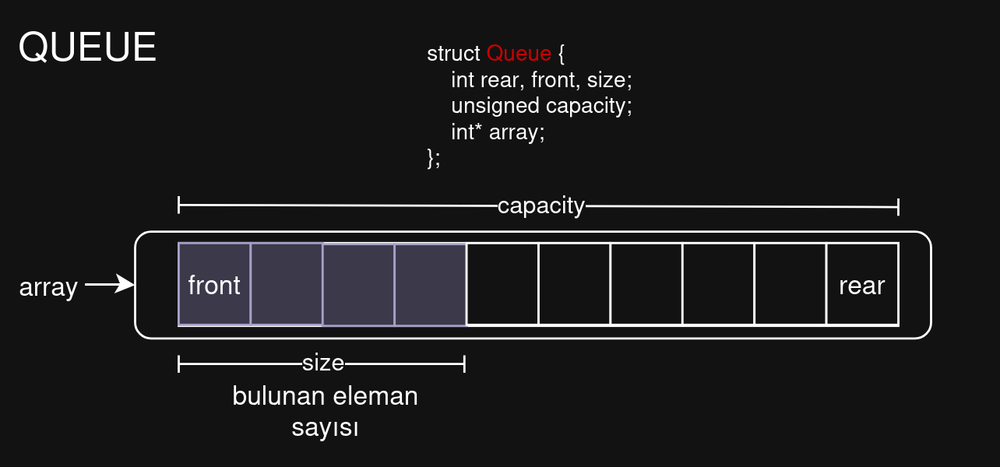
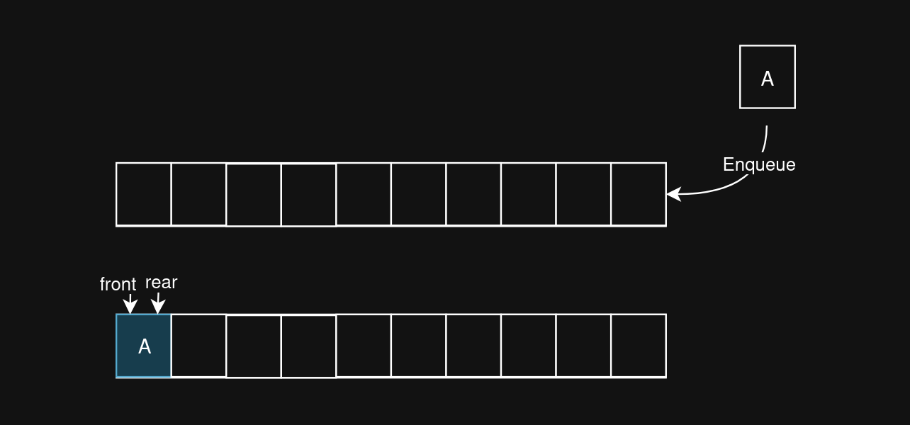
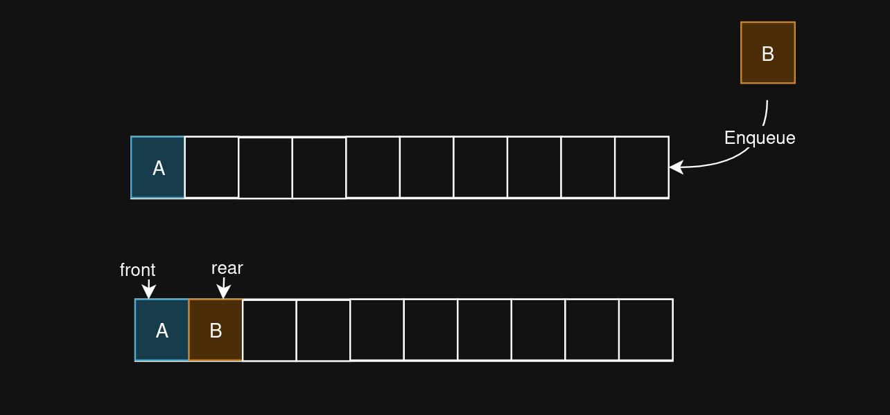
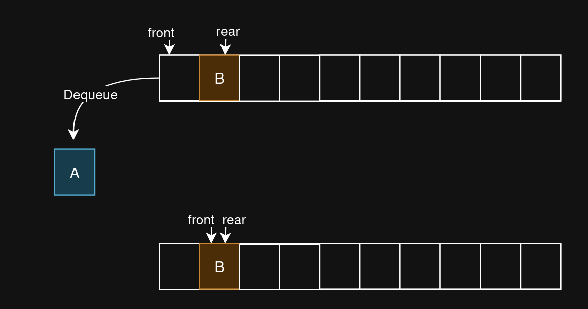
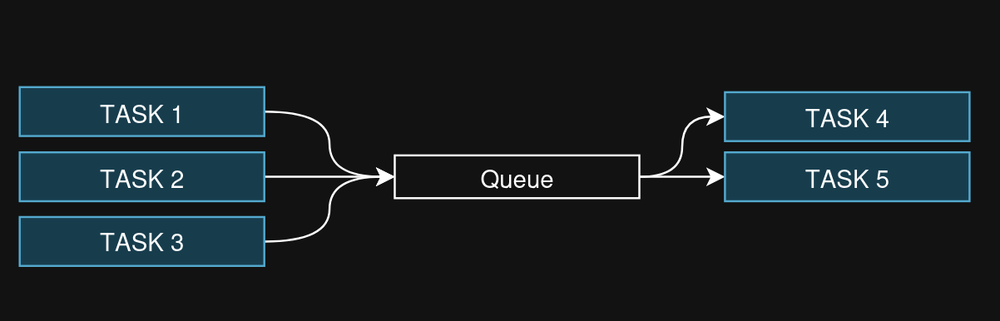
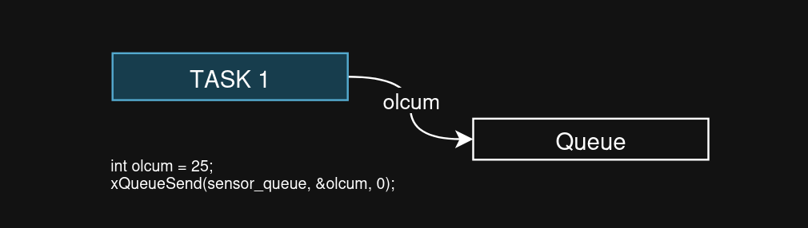
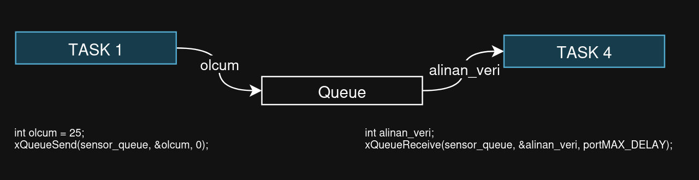
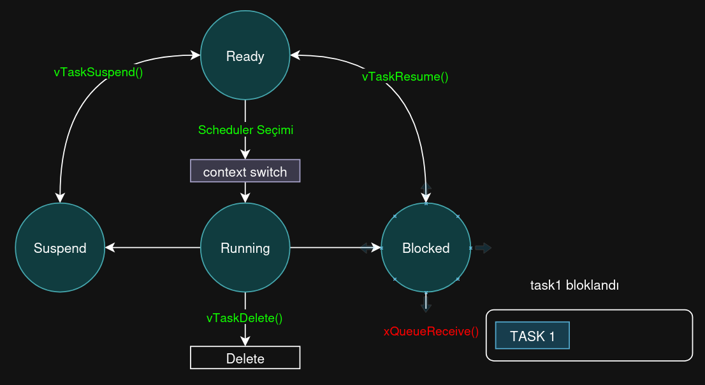
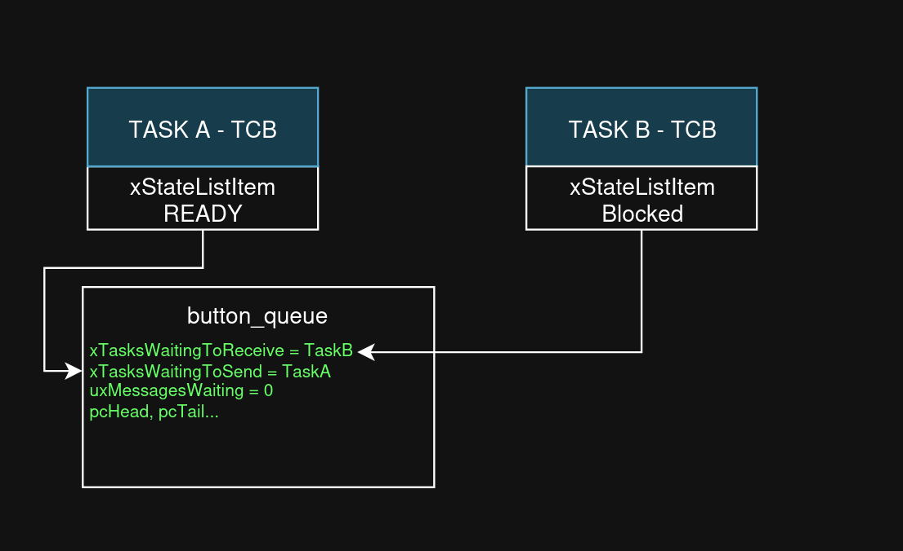

# QUEUE Nedir?

Queue (kuyruk) çokca kullanılan bir veri yapısıdır. Ben özellikle ESP32 için mantığına bakacağım ve burada anlatacağım.

> Bu yazımda kullanılan queue veri yapısını [DataStructureAndAlgorithm](https://github.com/FurcanY/DataStructureAndAlgorithm) repomdan bulabilirsiniz.

Bu yazımda bulunan tüm esp kodlarını ["esp32_projects"](https://github.com/FurcanY/github_esp32_projects) adlı repository'de bulabilirsiniz.



```c
struct Queue {
	int rear, front, size;
	unsigned capacity;
	int* array;
};
```

Queue veri yapısında aslında kolaydır, tek tek bakalım:

- **rear**: Kuyruğun en son kısmını gösterir. Yeni bir eleman ekleme bu kısımdan olur.
- **front**: Kuyruğun ilk baş kısmını gösterir. Eleman çıkışı bu kısımdan olur.
- **size**: Kuyruk içerisinde ne kadar eleman var onun bilgisini tutar.
- **capacity**: Kuyruğumuzun kapasite bilgisini tutar. Bu bilgi ile malloc yapılır.
- **array**: Kuyruğun tutulduğu bellek alanını gösteren pointer'dır.


## Queue oluşturma
```c
struct Queue* createQueue(int _capacity) {
	struct Queue* yeni = (struct Queue*)malloc(sizeof(struct Queue));
	if (yeni) {
		yeni->capacity = _capacity;
		yeni->rear = _capacity - 1;
		yeni->front = 0;
		yeni->size = 0;
		yeni->array = (int*)malloc(sizeof(int) * _capacity);
	}
	return yeni;
}
```

`array` pointer'ına `malloc` ettiğimiz diziyi veriyoruz ve queue aslında bu oluyor. 

Diğer gerekli bilgiler de oluşturulan struct'a verilir.

## Boş mu Dolu mu?
Kuyruğun boş mu dolu mu olduğunu kontrol etmemiz gerekli. Bu bilgilere göre kuyruğa ekleme ve kuyruktan alma işlemlerini yaparız. Bize kontrol sağlar.

```c
// kuyruk dolu mu kontrolu
int isFull(struct Queue* yeni) {
	return (yeni->size == yeni->capacity);
}
// kuyruk bos mu kontrolu
int isEmpty(struct Queue* yeni) {
	return (yeni->size == 0);
}
```

Kuyruk boşsa size bilgisi 0 olur. Kuyruk doluysa kapasitemiz kadar veri içerisinde vardır yani size'ı capacity'e eşit olur.

## Veri Ekleme - Enqueue


Görselde gördüğünüz gibi veri ekleme kuyruğun arka kısmından olur, veri eklenince `rear` değeri en son eklenen elemanın indisini gösterir.



Eğer ikinci bir eleman eklersek `rear` bir artar. `front` değeri eleman çıkışı olmadığından hala ilk indisi göstermektedir.


## Veri Çıkarma - Dequeue



Veriyi kuyruktan çıkarma ise ön kısımdan gerçekleşir. Veri çıktığı zaman `front` bilgisi bir sonraki elemanı gösterir.


# ESP-IDF QUEUE

Evet queue'nin ana mantığını anladıysak artık kullanım alanından birisi olan ESP-IDF FreeRTOS içerisinde bakacağız.

ESP32 içerisinde kuyruğun struct yapısı şu şekildedir:

```c
typedef struct Queue_t {
    int *pcHead;                      // Queue'nun başlangıç adresi
    int *pcTail;                      // Queue'nun bitiş adresi
    int uxMessagesWaiting;            // Şu an queue'da bekleyen mesaj sayısı
    
    List_t xTasksWaitingToSend;       // Göndermek için bekleyen task'ler
    List_t xTasksWaitingToReceive;    // Almak için bekleyen task'ler
    
    int uxLength;                     // Maksimum eleman sayısı
    int uxItemSize;                   // Her bir elemanın boyutu (byte)
    
    int *pxWritePointer;              // Yazma pointer'ı (sonraki yazılacak yer)
    int *pxReadPointer;               // Okuma pointer'ı (sonraki okunacak yer)
} Queue_t;
```

ESP'de kuyruğu task'ler arasında veri göndermek için kullanılır. Bundan dolayı struct içerisinde farklı struct'lar vardır.




ESP içerisinde queue kullanım tarzları şunlardır:

- Bir task veri üretiyor, başka task işliyorsa
- Verilerin sırası önemliyse (FIFO - First In First Out)
- Birden çok task aynı anda veri gönderecekse
- Veri akış hızı dalgalıysa (buffer görevi görür)
- Task'lerin senkronize olması gerekiyorsa (bekleme mekanizması)

## Çalışma Mantığı

### 1) Queue Oluşturma

```c
QueueHandle_t sensor_queue = xQueueCreate(
    5,              // Maksimum 5 eleman saklayabilir
    sizeof(int)     // Her eleman int boyutunda (4 byte)
);
```
Aslında benim yaptığım kuyruk yapısına baya benziyor. 5 `capacity` ve `sizeof(int)` ise integer değer saklayacağını gösterir.

### 2) Veri Gönderme

```c
int olcum = 25;
xQueueSend(sensor_queue, &olcum, 0);
// &olcum: Gönderilecek verinin adresi
// 0: Bekleme süresi (0 = hemen döner, doluysa hata)
```
Bir task içerisinde bu şekilde kuyruğa veri gönderebilirsiniz.



### 3) Veri Alma

```c
int alinan_veri;
xQueueReceive(sensor_queue, &alinan_veri, portMAX_DELAY);
// &alinan_veri: Verinin kopyalanacağı adres
// portMAX_DELAY: Veri gelene kadar sonsuza kadar bekle
```
Diğer bir task içerisinde ise gönderilen veriyi alabilirsiniz.



---
Kuyruğun en güçlü özelliği ise `task`'leri bloke edebilir.

Örnek bir task ile bloke olayına bakalım:
```c
void task1(void *pvParams) {
    int veri;
    
    while(1) {
        // Queue'da veri yoksa, task BURADA BEKLER (CPU harcamaz)
        xQueueReceive(queue, &veri, portMAX_DELAY);
        
        // Bu satıra ancak veri gelince gelinir!
        printf("Veri alındı: %d\n", veri);
    }
}
```


Göresle FreeRTOS Task Durum Diyagramında bloke olma kısmında `xQueueReceive` ile bloke olmuş `task1` vardır.

Aynı mantık queue doluysa gönderme kısmında da bloke olur.

```c
// Queue doluysa, task burada bekler.
if (xQueueSend(queue, &sayac, pdMS_TO_TICKS(100)) == pdTRUE) {
    printf("Veri gönderildi: %d\n", sayac);
}
```


## EventListItem ile İlişkisi

FreeRTOS içerisinde queue event ile task bekleme listesine alınabilir. Burada queue ile bir ilişkisi mevcuttur. Biraz bu konuyu açalım:

```c
xQueueReceive(queue, &veri, portMAX_DELAY);
```
Bu kod ile eğer veri yoksa beklemeye aldığını yukarda anlattık. Aslında burada bekleme olayı `eventListItem` ile queue'un bekleme sırasına alınmasıdır.



Bu görselde Task A veriyi queue ile gönderiyor, Task B ise bu veriyi alıncaya kadar `blocked` durumunda bekliyor.

Örnek bir kod yazarak bunu açıklayalım:

## Kodlama

Task A ve Task B adında iki adet task oluşturacağız. Task A buton polling ile butonun durumunu alıp queue'a gönderecek. Task B ise queue'dan veri bekleyecek, aldığı bilgiyle beraber `led` durumunu değiştirecek.

#### Tanımlamalar
```c
#define LED_GPIO 4
#define BUTTON_GPIO 5


// queue oluşturma
QueueHandle_t button_queue = NULL;
```
ESP32 kartının 4 numaralı GPIO pini led için, 5 numaralı GPIO pini ise buton için tanımlarız. Daha sonra bir queue tanımlarız. Bu queue app_main içerisinde ayarlamalar yapılırken oluşturulur. Burada tanımlamaızın sebebi `global varriable` olarak tüm task'lerin erişebilmesini sağlamaktır. app_main içerisinde local varriable tutup parametre ile de gönderip yapabilirdim ama şu anda kolaylık olsun diye yapmadım.

#### main_app()
```c
void app_main(void)
{
    // button
    gpio_reset_pin     (BUTTON_GPIO                     );
    gpio_set_direction (BUTTON_GPIO, GPIO_MODE_INPUT    );
    gpio_set_pull_mode (BUTTON_GPIO, GPIO_PULLUP_ONLY   );
    // led
    gpio_reset_pin     (LED_GPIO                    );
    gpio_set_direction (LED_GPIO,GPIO_MODE_OUTPUT   );
    gpio_set_level     (LED_GPIO,0                  );
    
    // queue oluşturma
    button_queue = xQueueCreate(5,sizeof(int));

    // task1 oluşturma
    xTaskCreate(
        task_a,"button_task",2048,NULL,2,NULL
    );

    // task2 oluşturma
    xTaskCreate(
        task_b,"led_task",2048,NULL,1,NULL
    );

    // main task silinebilir.
    
}
```
Görüldüğü gibi burayı ayarlama yeri olarak kullandım. İlk olarak buton ve led için GPIO ayarlarını yaptım, daha sonra kuyruğu oluşturdum. En sonda ise task'leri oluşturdum.
#### xQueueCreate(5,sizeof(int))
- **5:** Kuyruk kapasitesidir.
- **sizeof(int):** Her bir elemanın boyutudur. Ben integer koyacağımızdan dolayı `sizeof(int)` kullandım.


#### Task A
```c
/* --- Task A ---*/ 
void task_a (void *pvParameters)
{
    int last_state = 1,state;
    while (true)
    {
        state = gpio_get_level (BUTTON_GPIO);

        if (state != last_state) {
            vTaskDelay (20 / portTICK_PERIOD_MS);

            xQueueSend(button_queue,&state,( TickType_t ) 0);
            last_state = state;
        }
        vTaskDelay (50/portTICK_PERIOD_MS);
    }
}
```
Bu task içerisinde ilk olarak butonun durumu sonsuz döngü içerisinde alınır, alınan değer son alından değerden farklı ise butona basma veya çekme işlemi yapılmıştır, state ile bu durumu tespit ederiz. Bu durum tespit edildikten sonra 20ms bekleriz. Bunun sebebi `button debouncing` durumunu engellemektir.

`xQueueSend(button_queue,&state,( TickType_t ) 0);` kodu ile oluşturulan kuyruğa butonun durumu gönderilir.
- **button_queue:** veri gönderilecek olan kuyruk
- **&state:** gönderilecek olan verinin adresi
- **( TickType_t ) 0:** kuyruk doluysa bekleme süresi. Bu kod için kuyruk doluys göndermekten vazgeçer.

En sonda da task cpu0 içerisinde hep kalmasın diye 50ms bekleme süresi koyuyoruz.


#### Task B
```c
/* --- Task B ---*/ 
void task_b (void *pvParameters)
{

    int button_state;
    while(true){
        if (xQueueReceive (button_queue,&button_state,portMAX_DELAY)){
            if (!button_state) {
                gpio_set_level (LED_GPIO,1);
            }
            else {
                gpio_set_level (LED_GPIO,0);
            }
        }
        vTaskDelay (50/portTICK_PERIOD_MS);
    }
}
```

Bu task içerisinde de sonsuz döngü içerisinde kuyruktan veri alımı yaptım. Eğer kuyrukta veri yoksa `eventListItem` ile task bekleme listesine alınır. Veri geldiğinde running durumuna geçer ve alt satırdaki kodları çalıştırır.

Kuyruktan veri gelince buton durumuna göre ledi yakıp söndürdüm.

#### xQueueReceive (button_queue,&button_state,portMAX_DELAY)
- **button_queue:** okunacak olan kuyruk
- **&state:** gelen verinin yazılacağı adres
- **( TickType_t ) 0:** kuyrukta veri yoksa bekleme süresi. Bu kod için sonsuza kadar bekler.

# Sonuç

Evet bu yazımda kuyruk veri yapısı nedir ve nasıl kullanılır bunu öğrendik. ESP-IDF'de kuyruk task'ler için kullanılabilir olabiliyor.

Diğer konularımda FreeRTOS ve ESP konularını işlemeye devam edeceğiz. Tekrar görüşene dek hoşçakalın!