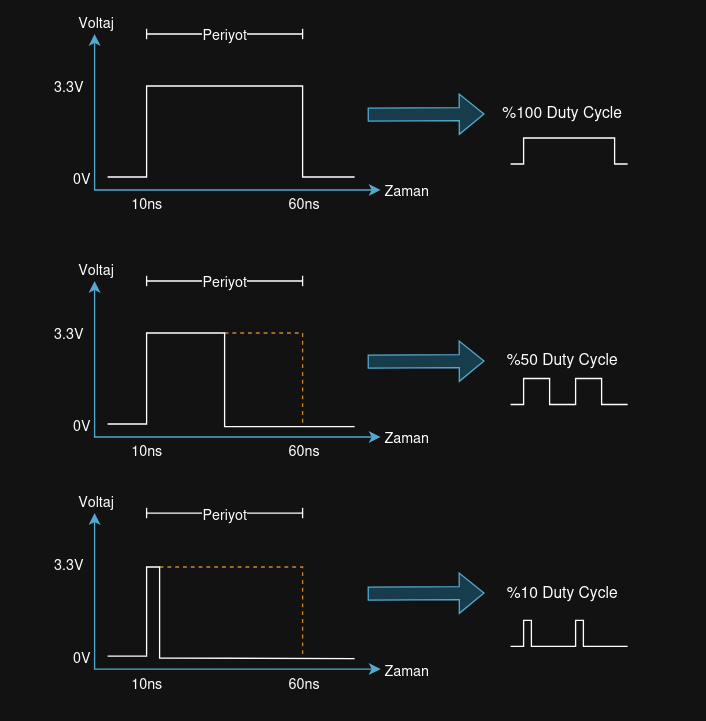
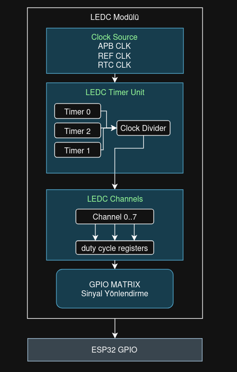
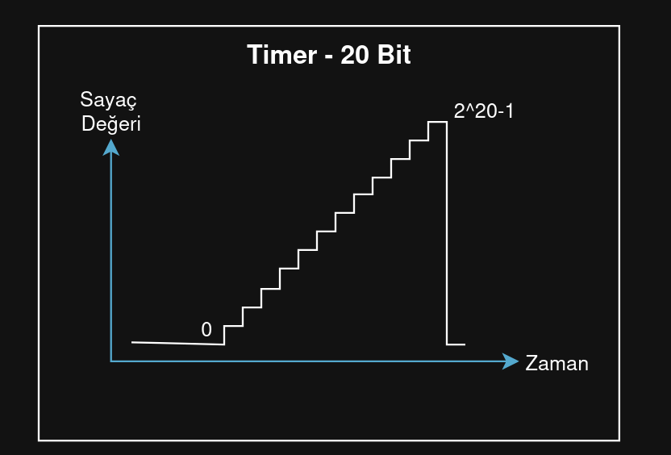
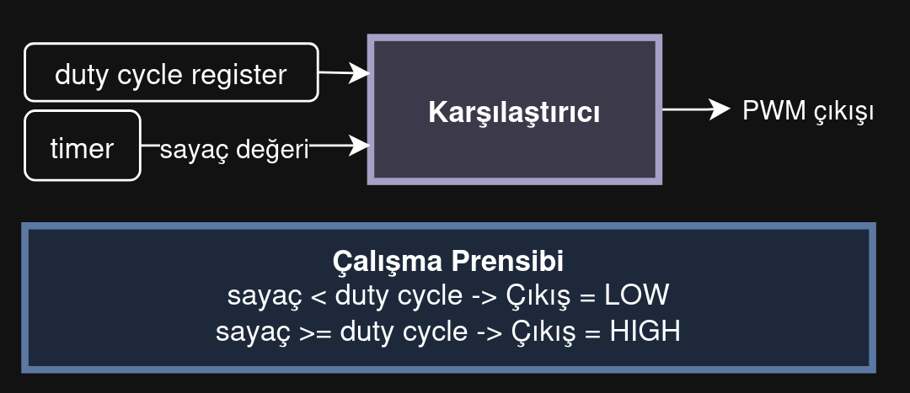

Bu yazıda sizlere PWM nedir ve ESP32 ile PWM nasıl kullanılır sorusuna elimden geldikçe cevap vermeye çalışacağım. Birileri **"Sen kimsin de bize öğretiyorsun?"** diye sorabileceğini biliyorum ve tamamen haklısınız. Ben bu yazıları başlıca kendi referansım olması için yazıyorum, fakat yazılmışken bunun web sitemde kalmasını istiyorum. Geçmişe baktığımda neler yapmış olduğumu görmek bana iyi hissettiriyor.

Bu yazımda bulunan tüm esp kodlarını ["esp32_projects"](https://github.com/FurcanY/github_esp32_projects) adlı repository'de bulabilirsiniz. Orayı güncel tutmaya çalışıyorum. Ayrıca yanlış anlattığımı veya eksik anlattığımı düşündüğünüz yer varsa github üzerinden `issue` açarak bana bildirebilirsiniz. Bu yazılardaki amacım bir şey bildiğimi göstermek değil, her zaman doğru bilgiye ulaşmayı hedeflemektir.

# Pulse Width Modulation - PWM Nedir?

PWM, dijital bir sinyali kullanarak analog bir değeri simüle etmeyi amaçlar. Bir dizi darbe genişliği ve periyor kullanılarak oluşturulur. Darbe genişliği, sinyalin yüzdesel olarak ne kadar süreyle yüksek seviyede olduğunu belirtir.

Örnek olarak bir PWM sinyalinin periyotu 70ms ve darbe genişliği 35ms olsun. Bu sinyalin ortalama değeri `35/70 *100` 'den 50 değerini alır. Yani buradan sinyalin 35ms boyunca açık 35ms boyunca kapalı olduğunu anlarız.

#### Duty Cycle
Bir Devrenin `açık` olduğu sürenin, devrenin `kapalı` olduğu süreyle kıyaslandığı bir oransal ifadedir. Örneğimiz için `duty cycle oranı %50 ` olacaktır.



PWM'in üç ana parametresi vardır.
- **Frekans:** Sinyalin 1 saniyede kaç kez açılıp kapandığı bilgisidir. (Hz)
- **Periyot:** Bir Aç-Kapa döngüsünün süresidir. (1/f)
- **Duty Cycle:** Sinyalin yüzde kaç açık kaldığı bilgisidir.

## PWM Kullanım Alanı

PWM sinyalleri mikrodenetleyici ile birçok alanda kullanılır.
- LED parlaklığını ayarlama
- Fan hızını ayarlama
- Ses seviyesini ayarlama
- Motor hızını ayarlama
- ....

Ben bu yazımda basitçe bir ledi pwm ile yakmayı göstereceğim. Bunun için esp'nin [ledc](https://docs.espressif.com/projects/esp-idf/en/stable/esp32/api-reference/peripherals/ledc.html) kütüphanesini kullanacağım. Detaylı ve sıkıcı anlatım olarak Espressif sitesinden dökümanı okuyabilirsiniz.

## ESP32 LEDC (LED Control)



LEDC özel olarak PWM sinyalleri üretmek için tasarlanmış bir donanım modülüdür. CPU'dan bağımsız olarak çalışabildiğinden performansı artırır.

Böylece CPU uyku modundayken bile PWM üretebilir.


ESP32'de birbirinden bağımsız 4 adet `timer` bulunur. Her timer `20bit` bir sayaç içerir. Bu sayaç sürekli sayar ve belirli bir değere ulaşınca sıfırlanır.

Timer'lara daha sonra detaylı bakarız ama şu bilgiyi verelim:


Timer'lar sıfırdan veya belirlenen bir başlangıç değerinden başlarlar ve her bir cycle'da bu değeri artırırlar. Bu değer timer'ın çözünürlük değerine ulaştığında `zaman kesmesi` (timer interrupt) sinyali oluşturular ve bu sinyal kodlamada çokca kullanılır.

### Channel

8 Adet bağımsız kanal vardır. Her kanalda konfigürasyon, başlangıç noktası ve duty cycle bilgisi içeren bir struct'ı vardır. Ayrıca her kanalda bir adet karşılaştırıcı devresi bulunur (comparator).



Karşılaştırıcı devresi Timer'ın `sayaç bilgisi` ile duty cycle register'dan `duty cycle` bilgisini alır ve karşılaştırır. Eğer timer duty cycle'dan küçükse pwm çıkışı olarak `0` verir, büyükse pwm çıkışı olarak `1` verir.

### Fade (Yumuşak Geçiş)

Basitçe içeriği şu şekildedir:

```c
// Fade modülü register'ları
typedef struct {
    uint32_t start;     // Başlangıç duty değeri
    uint32_t end;       // Bitiş duty değeri
    uint32_t step;      // Adım büyüklüğü
    uint32_t interval;  // Adım aralığı (ms)
    uint32_t status;    // Durum bilgisi
} ledc_fade_reg_t;
```

Her interval süresinde duty değerini step kadar değiştirir, böylece yumuşak bir geçiş sağlayan pwm değeri oluştur. Bu modül de interrupt üretebilir ve CPU müdahelesi olmadan çalışabilir.


## KODLAMA

Channel ile pwm sinyali oluşturalım.

Kullanacağımız ayarlamalar için gerekli tanımlamaları yapalım:
```c
// gpio tanımlama
#define GPIO_LED 4
// ledc tanımlamaları
#define LEDC_TIMER      LEDC_TIMER_0         // timer 0 seçilir
#define LEDC_MODE       LEDC_HIGH_SPEED_MODE // yüksek hız modu seçilir
#define LEDC_RESOLUTION LEDC_TIMER_12_BIT    // 12 bit çözünürlük
#define LEDC_FREQ       5000                 // 5000 Hz ferkans
#define LEDC_CHANNEL    LEDC_CHANNEL_0       // Kanal 0 seçilir
```


`timer_init` adında bir fonksiyon oluşturarak timer ile ilgili ayarlamalı burada yapalım.

```c
    // Timer Yapılandırması
    ledc_timer_config_t timer_conf = {
        .speed_mode         = LEDC_MODE       ,
        .duty_resolution    = LEDC_RESOLUTION ,
        .timer_num          = LEDC_TIMER      ,
        .freq_hz            = LEDC_FREQ       ,
        .clk_cfg            = LEDC_AUTO_CLK
    };

    // yapılandırmayı ayarlayalım
    ledc_timer_config(&timer_conf);

    // Kanal Yapılandırması
    ledc_channel_config_t channel_conf = {
        .gpio_num       = GPIO_LED          ,
        .speed_mode     = LEDC_MODE         ,
        .channel        = LEDC_CHANNEL      ,
        .intr_type      = LEDC_INTR_DISABLE ,
        .timer_sel      = LEDC_TIMER        ,
        .duty           = 0                 ,
        .hpoint         = 0                     
    };

    //yapılandırmayı ayarlayalım
    ledc_channel_config(&channel_conf);
```

Burada `ledc` kütüphanesinde config fonksiyonlarına gerekli bilgileri verdim.

`app_main` içerisinde `timer_init` çağırdım ve gerekli task'i oluşturdum.

```c
    // timer initialize edelim
    timer_init();

    // task oluşturma
    xTaskCreate(
        led_task  ,
        "led task 1",
        4096        ,
        NULL        ,
        1           ,
        NULL
    );
```

`led_task` task'inde ise ledimizi yavaş yavaş yakıp söndüreceğimiz animasyonlar mevcut:

```c
void led_task (void *param){

    while (true)
    {
        led_1();
        vTaskDelay (100/portTICK_PERIOD_MS);
        led_2();
        vTaskDelay (100/portTICK_PERIOD_MS);
    }
}
```

`led_1` içerisinde ilk olarak duty cycle değerini for döngüsü içerisinde artırıp bunu channel'a etki etmesi için `ledc_set_duty` ve `ledc_update_duty` fonksiyonları ile ayarlarız. Daha sonra aynı mantıkla for döngüsü içerisinde duty cycle değerini azaltırz. Bunu da ana for döngüsü içerisinde yaparsak yavaş yavaş yanıp sönen led animasyonumuz olur.

parlaklığı artırırız:
```c
        for (duty = 0; duty < 4096; duty += step )
        {   
            // duty değiştir
            ledc_set_duty (
                LEDC_MODE       ,
                LEDC_CHANNEL    ,
                duty
            );
            // değişikliği uygula
            ledc_update_duty (
                LEDC_MODE,
                LEDC_CHANNEL
            );

            // küçük bir bekleme
            vTaskDelay (20/portTICK_PERIOD_MS);
        }
```

parlaklığı azaltırız:
```c
        // parlaklığı azaltalım
        for (duty = 4096; duty >= 0; duty -= step )
        {
            // duty değiştir
            ledc_set_duty (
                LEDC_MODE       ,
                LEDC_CHANNEL    ,
                duty
            );
            // değişikliği uygula
            ledc_update_duty (
                LEDC_MODE,
                LEDC_CHANNEL
            );

            // küçük bir bekleme
            vTaskDelay (20/portTICK_PERIOD_MS);
        }
```

`led2` fonksyionunda ise bu duty cycle geçişleri sert olacak şekilde kodladım. Böylece farkı gözümüzle daha iyi fark edebiliriz.

```c
    // sert bir geçiş ile pwm'i gözlemleyelim
    int duty= 0;
    int step = 4096/7;
```

Sonuç olarak kodu çalıştırdığımızda ledimiz pwm ile yanıp sönecektir.


# Sonuç

Bugün bildiğim kadarıyla PWM nedir ve PWM ESP-IDF framework'ü ile nasıl kullanılır bunu anlatmaya çalıştım. Yardımcı olabildiysem ne mutlu bana


Sonraki yazılarımda görüşene dek, hoşcakalın!

